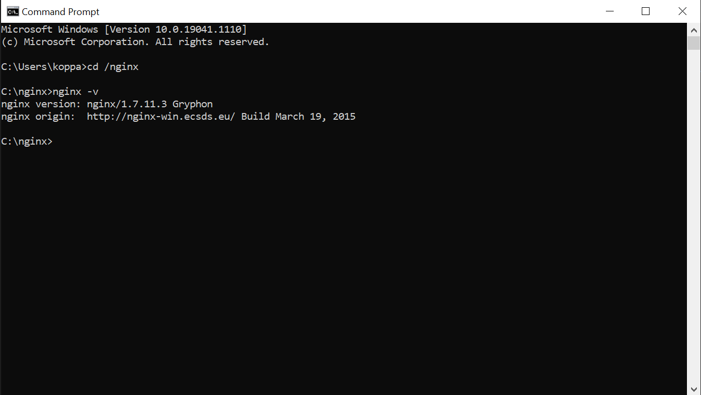
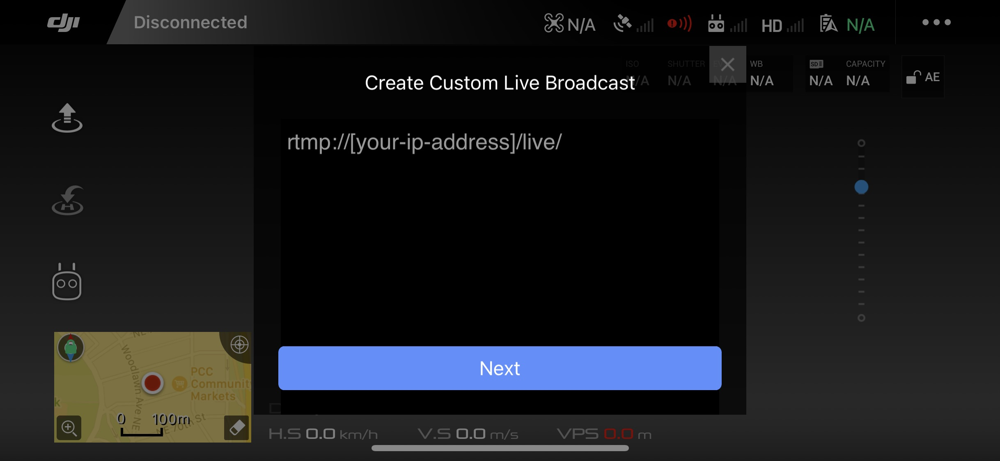

<h1 align="center"><strong>Real-Time Drone Footage Processing</strong></h1>

  

## Description

This repository contains processes to read and edit drone footage in real-time through the use of NGINX and DJI GO 4's 'custom rtmp stream' feature.

## Table of Contents

1. [Installation](#installation)
2. [Usage](#usage)
3. [Bugs](#bugs)
4. [Future Development](#future-development)
5. [Contributing](#contributing)
6. [License](#license)

## Installation

This program requires [NGINX](https://www.nginx.com/) and [OpenCV](https://opencv.org/). OpenCV can be installed by running the following:

> `pip install opencv-python`

Installing NGINX is more involved.

1. Download the necessary packages from [http://nginx-win.ecsds.eu/download/](http://nginx-win.ecsds.eu/download/). This program uses version `1.7.11.3 Gryphon` and `vcredist_x86` - both need to be downloaded.
2. Extract the `nginx 1.7.11.3 Gryphon` zip file to a new folder in your C: drive named `nginx`.
3. Move `nginx.conf` from this repository to your `C:\nginx\conf\` folder. Any updates made to this file in the future will have to be duplicated in your nginx folder.
4. In the terminal, navigate to your nginx folder using `cd /nginx`. Running `nginx -v` should output something similar to the following:

  

    
  

5. You should now be able use nginx:

   - Navigate to your nginx folder using `cd /nginx`
   - `start nginx` <- starts server
   - `.\nginx -s stop` <- fast shutdown
   - `.\nginx -s quit` <- graceful quit (preferred)
   - `.\nginx -s reload` <- reloads server

## Usage

Once all necessary dependencies are downloaded and installed, the program can be used as follows:

1. Create a file named `info.py` and add your IPv4 address. This information can be found by running the terminal command `ipconfig`.
2. Boot the nginx server in terminal using `cd /nginx` and `start nginx`.
3. In DJI GO 4, begin streaming to the nginx server using the 'custom rtmp' option.

  

    
  

4. Navigate to this repository and run `python main.py`.
5. Real-time processes are invoked using the following key commands:
   - `q`: stops and quits the stream object
   - `o`: decreases contrast
   - `p`: increases contrast
   - `k`: decreases brightness
   - `l`: increases brightness
   - `n`: decreases playback speed
   - `m`: increases playback speed

Notes:

## Bugs

- Manually entered frame rate not synced with drone output. DJI streams at 30 fps, manually entering 30 fps in `main.py` results in a slightly slower OpenCV output. Manually entering 38 fps seems more closely aligned with reality.

## Future Development

- Currently, the program exits when there are no edited frames to display. A catch to buffer will be added (unless a fix to the unsynced fps bug nullfies this issue).
- More processing methods are being added on different branches. Check them out!

## Contributing

For further questions, comments, and suggestions, please reach out through [GitHub](https://github.com/kkolyvek) or via email at kk674@cornell.edu.

## License

Copyright (c) Moosh Systems 2021

---
